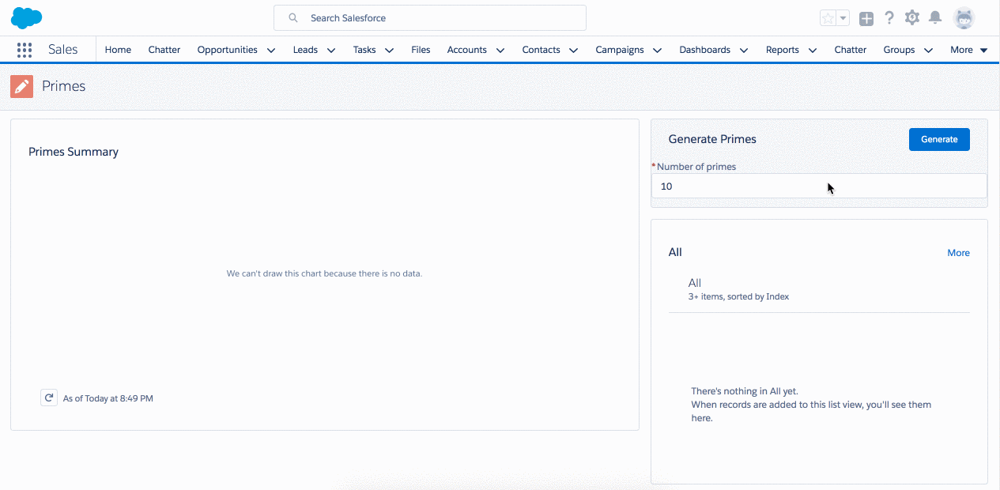
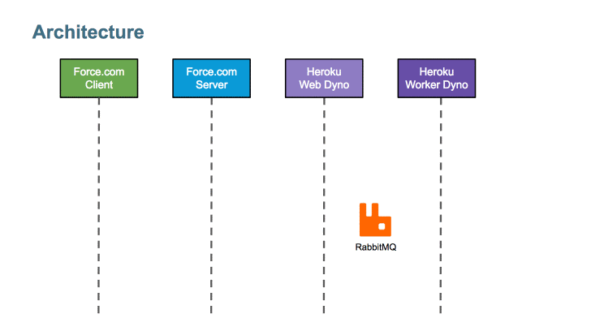

ffdc-df17-heroku-compute 
===

Background
---

This repo accompanies the Dreamforce '17 session **[Beat Governor Limits By Taking Your Compute Processes to Heroku](https://success.salesforce.com/Sessions#/session/a2q3A000001yuLtQAI)**. It demonstrates a distributed architecture which spans Force.com and Heroku.

Why might you want to build such an app? I'm glad you asked! Heroku does what force.com don't.
* Heroku gives you access to industry standard external libraries and tooling
	* For example, this app uses the open source NPM module [is-prime](https://www.npmjs.com/package/is-prime) to check for primality
* Is not constrained by governor limits
	* Process large volumes of data without batch apex
	* Make callouts to other web services with impunity
* Gives you far greater control
	* Continuous delivery instead of waiting for users to pull managed package versions

Getting Started
---
See the wiki for [local development](https://github.com/financialforcedev/df17-heroku-compute/wiki/Local-Development-Environment) and [deployment](https://github.com/financialforcedev/df17-heroku-compute/wiki/Deployment) instructions.

Architecture
---

Repository Structure
---
* This repository has 2 distinct components
	* [force](/force): The Force.com component of the application
	* [heroku](/heroku): The Heroku component of the application
* In production, you should use a separate repo for the force and heroku components

Contributing to the Repository
---
If you find any issues or opportunities for improving this respository, fix them!  Feel free to contribute to this project by [forking](https://help.github.com/articles/fork-a-repo/) this repository and make changes to the content.  Once you've made your changes, share them back with the community by sending a pull request. Please see [How to send pull requests](https://help.github.com/articles/creating-a-pull-request//) for more information about contributing to Github projects.

Reporting Issues
---
If you find any issues with this demo that you can't fix, feel free to report them in the [issues](https://github.com/financialforcedev/df17-heroku-compute/issues) section of this repository.